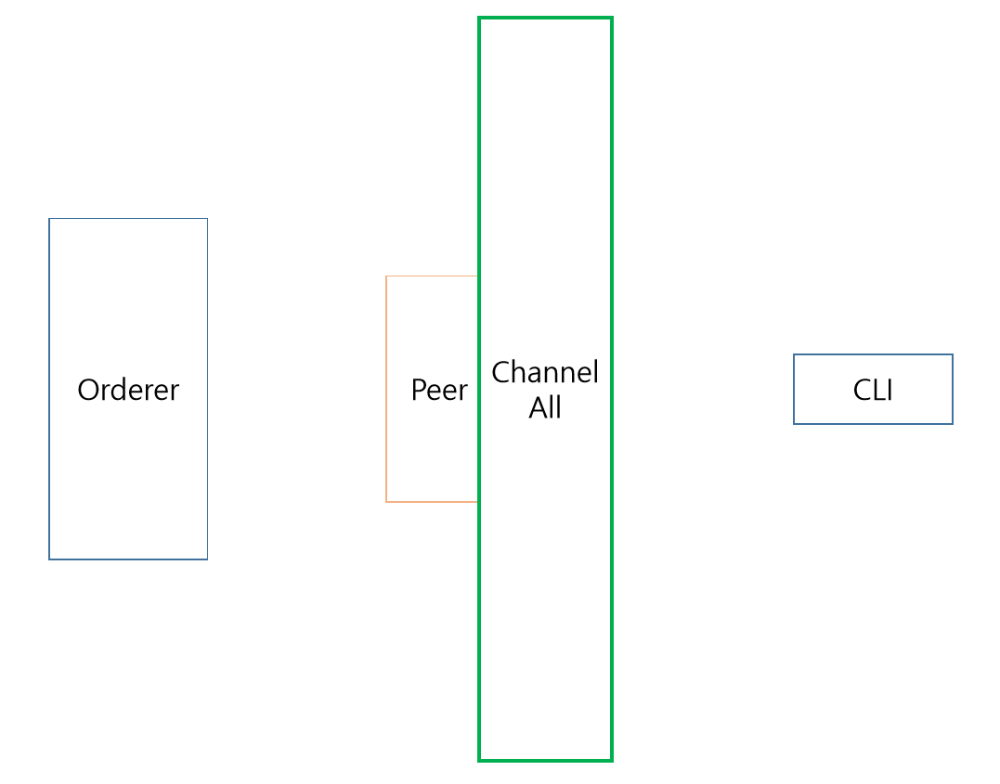

# how
1. sudo ./setup build
2. sudo ./setup run
3. sudo ./setup rm

# WARN!!
sudo ./setup rm에서 docker container을 모두 삭제하며, 미연동중인 volume도 다 삭제합니다.
sudo ./setup rmではDocker Containerをすべて削除します。尚、未連動のVolumeもすべて削除します。

# img

